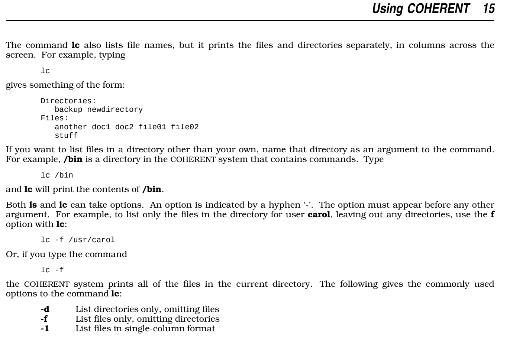

This is a port of 'lc' (List files in categories and columns) from MWC (Mark Williams Company) [Coherent UNIX](https://en.wikipedia.org/wiki/Coherent_(operating_system)).

You can find the original source tarball here: http://www.nesssoftware.com/home/mwc/source.php

The original source file is `COHERENT/romana/relic/d/bin/lc.c` in the archive.

## Manual

The original manual page:

## License

Released with the original [LICENSE](./LICENSE.md).
